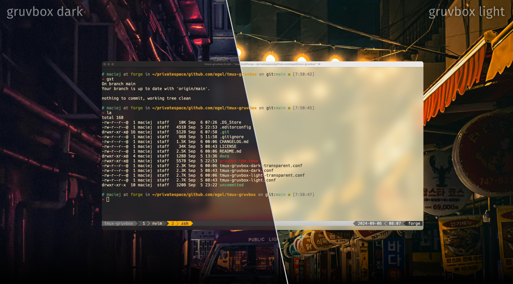

<div align="center">
    
    <h1>Gruvbox theme for Tmux</h1>
</div>

Theme with 'retro groove' flavor for [Tmux][github-tmux], based on Pavel Pertsev's [gruvbox colorscheme][github-grovbox] and inspired by work of [Gordon Chiam](https://gist.github.com/gchiam/4606522f513cc64b79ce). Subthemes switching inspired by [tmux-color-solarized][tmux-color-solarized].

<!--
  Using HTML table instead default markdown tables as provide it provide
  much better code readability especially for long columns.
-->

<div align="center">
  <a href="./docs/assets/img/gruvbox-dark-and-light-theme-structure.png" title="Grovbox dark and light themes for Tmux">
    
  </a>
</div>

> Screenshot made from macOS [alacritty][github-alacritty] terminal with xterm-256color and [Hack Nerd Font Regular][github-nerd-fonts].<br/>
> Backgrounds by [Aleksandar Pasaric][pexcel-1] and [Vishnu Murali][pexcel-2].

## Installation

**Available Themes**

- [`dark`](./docs/assets/img/gruvbox-dark-theme.png)
- [`light`](./docs/assets/img/gruvbox-light-theme.png)
- `dark-transparent` (experimental)
- `light-transparent` (experimental)

### Install manually

The simplest way is just:

> [!TIP]
> Always make a backup of your config files before any action.

```bash
cat tmux-gruvbox-dark.conf >> ~/.tmux.conf
```

### Install through [Tmux Plugin Manager](https://github.com/tmux-plugins/tpm)

Add plugin to the list of TPM plugins in `.tmux.conf` and select desired theme.

```bash
set -g @plugin 'egel/tmux-gruvbox'
set -g @tmux-gruvbox 'dark' # or 'light', 'dark-transparent', 'light-transparent'
```

Hit `prefix + I` to fetch the plugin and source it. Your Tmux should be updated with the theme at this point.

## Development

To run project locally:

1.  clone the repo to desired place

    ```bash
    cd $HOME/projects/
    git clone ...
    ```

1.  create symlink in plugin dir to the cloned repo:

    ```bash
    # cd to tmux plugin directory
    cd ~/.tmux/plugins/

    # create simlink to cloned repo
    ln -sf $HOME/projects/tmux-gruvbox/ tmux-gruvbox
    ```

1.  and in `~/.tmux.conf` set

    ```bash
    # add plugin
    set -g @plugin 'egel/tmux-gruvbox'
    # set desired options...
    set -g @tmux-gruvbox 'dark'
    ```

### Linters & formatters

To keep the files clean we use few program to help us achieve it:

1.  Editorconfig (make sure your editor have it)
2.  Markdown (prettier/prettierd)
3.  Shell (shellcheck, shfmt)

## License

GPLv3 - Maciej Sypień

[github-tmux]: https://github.com/tmux/tmux
[github-grovbox]: https://github.com/morhetz/gruvbox
[github-hack]: https://github.com/chrissimpkins/Hack
[github-nerd-fonts]: https://github.com/ryanoasis/nerd-fonts
[github-alacritty]: https://github.com/alacritty/alacritty
[tmux-color-solarized]: https://github.com/seebi/tmux-colors-solarized
[pexcel-1]: https://www.pexels.com/photo/urban-photo-of-an-alley-2411688/
[pexcel-2]: https://www.pexels.com/photo/lights-hanging-above-the-alley-in-a-city-at-night-27044195/
